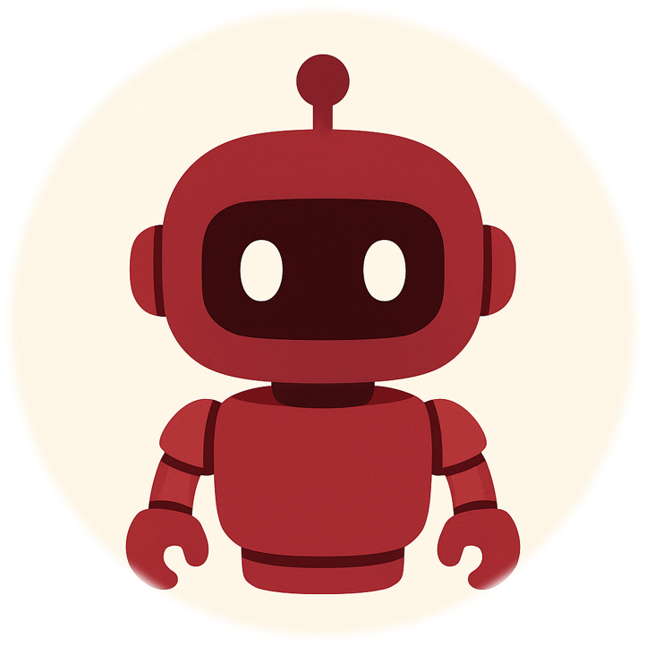

  
  <h3 style="margin: 0; font-size: 2.5rem;">
    <strong>Telerobotic Platform:</strong> 
    Remote Control of a Humanoid Robot
  </h3>

---

This project features an educational telerobotic platform designed for the remote operation of robots. It follows an orchestrator system architecture in which a central server receives commands from remote clients and routes them to the selected robot. 

Communications between nodes are handled through a custom, lightweight, application-layer protocol focused on clarity and functionality, minimizing overhead while remaining human-readable and easily extendable.

The platform includes two client-side implementations. The first one is a fully developed JavaFX application, offering a streamlined graphical interface for direct robot control. The second is a custom Unreal Engine 5 module that integrates into UE5 projects using a blueprint-friendly interface, enabling real-time robotic control from within Unreal-based projects.

To sum it up:

- Orchestrator-based platform
- Lightweight, human-readable custom protocol
- JavaFX GUI Client (ServerSolution/Client/Java-Client)[https://github.com/hugoperez3i/Robot-Control-Application/tree/main]
- UE5 Control module with native Blueprint integration (ServerSolution/Client/UE5-ClientAPI)[https://github.com/hugoperez3i/Robot-Control-UE5Module/tree/main]

This project merges the work of both my Telecommunications Systems Engineering and Biomedical Engineering bachelor’s theses, combining system-level communications design with applied robotics in a single, complete platform.