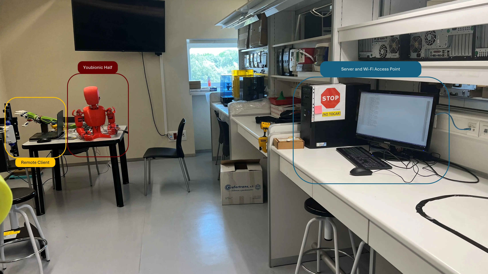
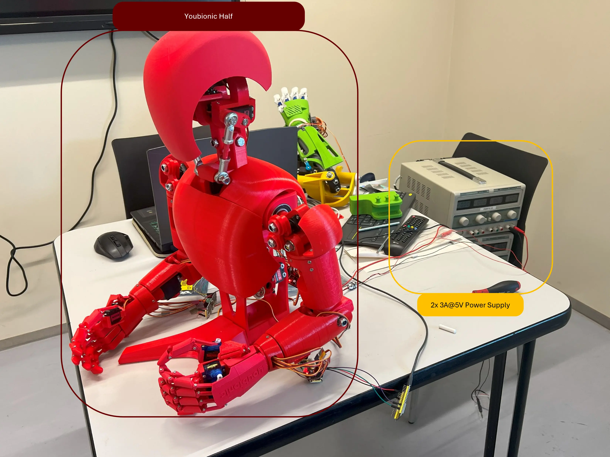
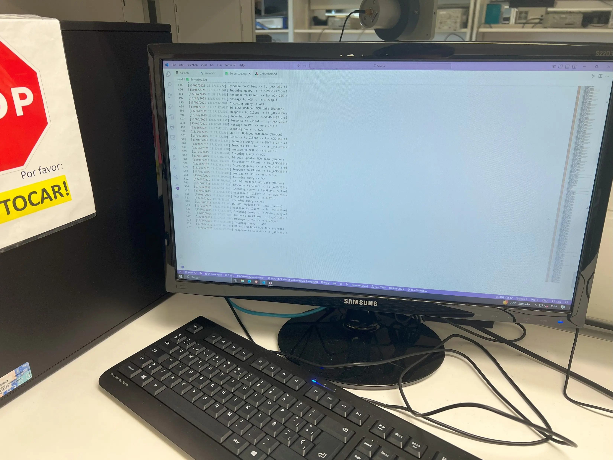

# Full Platform Showcase

A demo of the full platform, where the Youbionic Half is controlled via the JavaFX client, performing arm flexion and head rotation.

---

## Platform components

The platform consists of three parts:

- **Robotic system:** The Youbionic half and the power supplies that power it.
- **Server:** A computer acting both as server and Wi-Fi Access Point (AP).
- **Client:** The laptop is used to run the JavaFX client application and remotely operate the robot. In this demo, it is also used to view the MCU's verbose log, as well as powering the MCU. 

=== "Youbionic Half"

    { width=600, height=600 }

=== "Server"

    { width=600, height=600 }

=== "Verbose serial log (MCU)"

    { width=600, height=600 }

### Power requirements

While a proper power consumption study has not been conducted, the servos used by the robotic system do have a fluctuating power draw of 0.72 amps to 0.96 amps at idle. For this reason, the robot is currently hooked up to two DC power supplies, each capable of providing up to 3A@5V. This allows for normal operation of the robot, although the ideal configuration would use a single, high-amp DC power supply at 6 volts.

!!! warning ""
    Note that power usage depends on the robotic system's servo configuration, so this observation only applies to those using the same robotic platform and servo combination.

### Wi-Fi Connectivity

The computer acting as server, a Win10 machine, is also used to host the Wi-Fi network that the MCU will connect to. This is achieved by using Windows Mobile hotspot functionality, which allows a computer to share its current internet connection as a hosted Wi-Fi network. Since there's no port forwarding configured, remote operation from outside the networks the server is connected to is impossible.

!!! bug "Port Forwarding"
    The server has no login authentication, no encryption and, while it attempts to discard invalid queries, it makes no assurances that all malicious queries will be discarded. **As such, it is not recommended to set up a direct or transparent port forward.** Doing so will risk your computer and, at that point, you're on your own. 

    If port forwarding is desired, it should be done so through a proxy gateway that enforces some kind of log-in/authentication, traffic filtering or rate-limiting policies, to avoid potential risk to the computer hosting the server.

---

## Demo Video

Brief demonstration of how the JavaFX application can be used to remotely operate the Youbionic Half. As seen in the video, the delay is almost imperceptible.

<video width="600"  controls muted> 
    <source src="../../assets/demoJavaFX_web.mp4" type="video/mp4">
</video>

---
